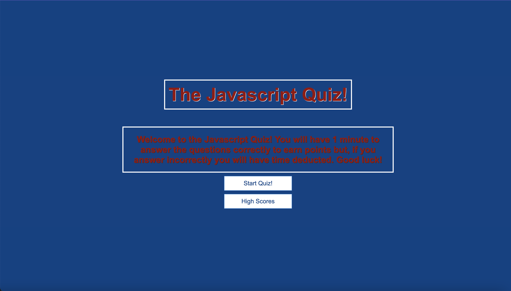
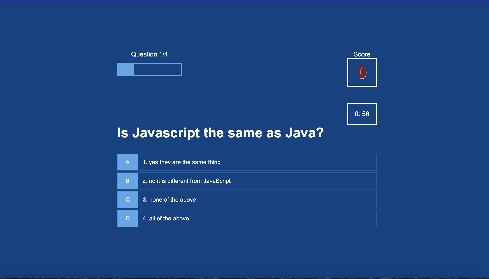
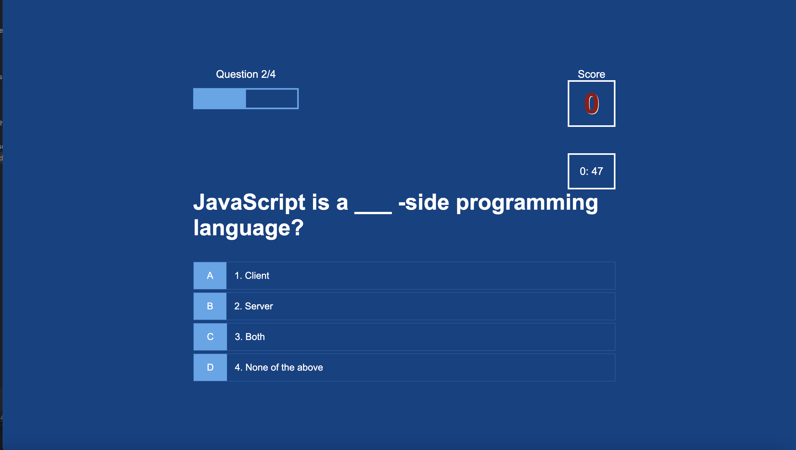
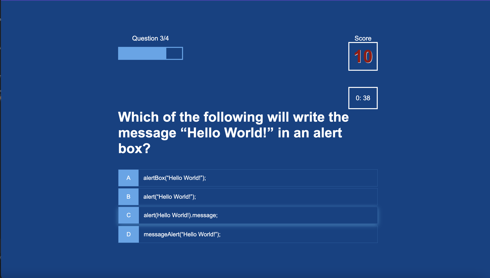
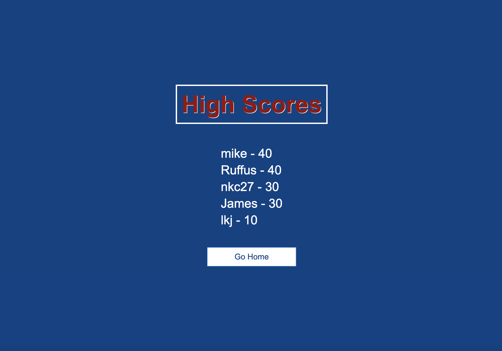

# The Javascript Quiz

## Introduction

I have designed a Javascript quiz that prompts the user a series of questions to be answered.
When the user hits start quiz then the timer is set and quesions will appear.
When the user gets the question correct then points will be added. 
When the user gets an incorrect question the the timer will be deducted of seconds giving the user less time to complete the quiz.
At the end of the quiz the user will have the option of saving their highscores with their name and will be saved for others to view and attept beating the score.

## Technologies Used

HTML
Javascript
CSS
.JSON

## Screenshots of the application

### Homescreen

### Question 1

### Question 2

### Question 3

### Highscores

## Live Link

Please click on the link below to go to the quiz.

 https://nkc27.github.io/The-Javascript-Code-Quiz/